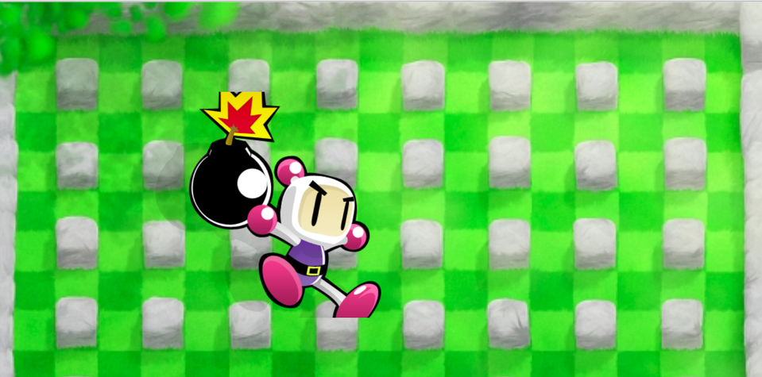

<<<<<<< HEAD
# My Awesome Project
Write a short sentence or two about this project and what it does. Be sure to include a link and a screenshot (we're front end devs so we can actually see our work!).
This is one of my first coding projects. Assignment was to create a replica of Bomberman and make an element move on key press.

**Link to project:** https://ayoskip.github.io/bomberman/

<

## How It's Made:

**Tech used:** HTML, CSS, JavaScript,

Created background using an image in HTML that I found through Google. Placed an image on top of the background and styled it with CSS. Once I had a background with an image of Bomberman I used jQuery to move the object on key press.

## Lessons Learned:

I learned how to interact with HTML,CSS, and JS in the same project.

**Ayo_Skip:** https://ayoskip.github.io

**Rock Paper Scissors:** https://ayoskip.github.io/Rocks.Papers.Scissors/

# Bomberman
First of many asssignments completed during winter Full Stack bootcamp with Resilient Coders.

**Link to project:** https://ayoskip.github.io/bomberman/

## How It's Made:
Nothing fancy here just a simple background image with another image sized with CSS and JS to make the image move.

**Tech used:** HTML, CSS, JavaScript

## Lessons Learned:
This was my first experience of successfully coding something that worked. That "WHOA" moment where I felt like I had solidified myself as a Developer.
